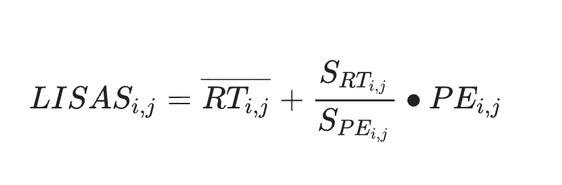

# Data Preparation for Task-Switching Paradigm

An R script that converts raw JSON logs from a computerized task-switching
paradigm into clean, BIDS-style behavioral TSV files, and computes a
combined speed–accuracy score (LISAS) per trial condition.

## Why this exists

Task-switching paradigms are a standard tool for probing cognitive
flexibility: how well an agent reconfigures its behavior when task demands
change. Participants alternate between blocks where they perform a single
task repeatedly ("single" blocks) and blocks where two tasks are intermixed
("mixed" blocks). Within mixed blocks, a trial is a **repeat** if it uses the
same task as the previous trial, or a **switch** if it doesn't. The
performance gap between switch and repeat trials (_switch cost_) is a
widely used index of executive control (Monsell, 2003; Vandierendonck et al.,
2010).

Comparing conditions on reaction time (RT) alone is confounded by
speed–accuracy trade-offs: a participant can look "faster" simply by being
less careful. This pipeline addresses that by computing **LISAS** (Linear
Integrated Speed-Accuracy Score; Vandierendonck, 2017), which folds error
rate into the RT scale:



where `SD_RT` and `SD_PE` are the standard deviations of RT and error
computed once across all of a participant's trials for a task, and `RT_j` /
`PE_j` are the mean correct RT and mean error rate within condition `j`
(single / repeat / switch). This yields one comparable score per condition
per subject, per task.

## What the script does

`process_flex_data.R` runs in four stages:

**1. Discover and validate files.** Every `.json` filename is parsed with a
regex that extracts the subject ID, task type (`sw` = switch, `si` =
single), and task name (e.g. `robot-s1`, `face-scene-s3`). Files whose task
name isn't in the expected 27-task session sequence (5 sessions × robot /
monster / face-scene, plus one unique task per session) are dropped.

**2. Select the final attempt.** A subject may have multiple JSON logs per
task (retries, incomplete runs). Only the file flagged `"type": "last-block"`
inside the JSON is kept, per subject × task.

**3. Reconstruct blocks and conditions.** The raw trial stream doesn't label
blocks directly — a sentinel value (`switches == "9"`) marks the start of a
new block. `compute_blocks()` walks the trial sequence and assigns a block
number accordingly. Each block is then classified as `single` (one task
throughout) or `mixed` (two tasks), and each trial is classified into a
`condition`:

| block_type | switches               | condition       |
| ---------- | ---------------------- | --------------- |
| single     | 0                      | `single`        |
| mixed      | 0                      | `repeat`        |
| mixed      | 1                      | `switch`        |
| any        | 9 (block start marker) | `NA` (excluded) |

**4. Score and export.** Per condition, the script computes mean correct RT,
mean error rate, and LISAS, prints a readable summary to the console for
sanity-checking, merges the condition-level LISAS back onto every trial row,
and writes one TSV per subject per task to a BIDS-style path:

```
output/
└── sub-XXXXXX/
    └── ses-training/
        └── beh/
            └── sub-XXXXXX_ses-training_task-<task>_beh.tsv
```

Output columns: `participant_id, group, switches, tasks, reaction_time,
answer_correct, block, block_type, condition, error, lisas`.

## Requirements

R ≥ 4.0 with `tidyverse`, `jsonlite`, `stringr`, `purrr`.

## Usage

Set `input_dir` (raw JSON logs) and `output_dir` (destination) at the top of
the script, then source it. It processes every subject × task combination
found in the input directory in one pass.

## Figures

- `figures/pipeline_flowchart.svg` — the four processing stages above, from
  raw JSON to scored TSV.
- `figures/task_design_schematic.svg` — the single-block vs. mixed-block
  trial structure and how repeat/switch conditions are assigned.

## References

- Monsell, S. (2003). Task switching. _Trends in Cognitive Sciences_, 7(3), 134–140.
- Vandierendonck, A., Liefooghe, B., & Verbruggen, F. (2010). Task switching: Interplay of reconfiguration and interference control. _Psychological Bulletin_, 136(4), 601–626.
- Vandierendonck, A. (2017). A comparison of methods to combine speed and accuracy measures of performance: A rejoinder on the binning procedure. _Behavior Research Methods_, 49(2), 653–673.
